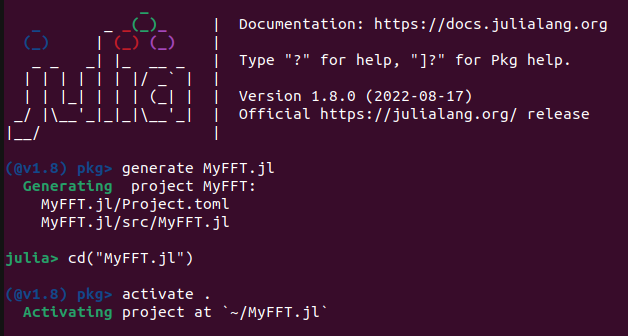

# PlatformAware.jl

[](https://github.com/decarvalhojunior-fh/PlatformAware.jl/actions/workflows/TagBot.yml)
[](https://github.com/decarvalhojunior-fh/PlatformAware.jl/actions/workflows/CompatHelper.yml)


_A package for improving the practice of **platform-aware programming** in Julia_.

It helps HPC package developers write code for different versions of computationally intensive functions (kernels) according to different assumptions about the features of the execution platform.

# What is platform-aware programming ?

We define platform-aware programming as the practice of coding computationally intensive functions, called _kernels_, using the most appropriate abstractions and programming interfaces, as well as performance tuning techniques, to take better advantage of the features of the target execution platform. This is a well-known practice in programming for HPC applications.

Platform-aware programming is especially suitable when the developer is interested in employing heterogeneous computing resources, such as accelerators (e.g., GPUs, FPGAs, and MICs), especially in conjunction with multicore and cluster computing.

For example, suppose a package developer is interested in providing a specialized kernel implementation for [NVIDIA A100 Tensor Core GPUs](https://www.nvidia.com/en-us/data-center/a100), meeting the demand from users of a specific cloud provider offering virtual machines with accelerators of this model. The developer would like to use CUDA programming with this device's supported *computing capability* (8.0). However, other users may require support from other cloud providers that support different accelerator models, from different vendors (for example, [AMD Instinct™ MI210](https://www.amd.com/en/products/server-accelerators/amd-instinct-mi210) and [Intel® Agilex™ F-Series FPGA and SoC FPGA]( https://www.intel.com/content/www/us/en/products/details/fpga/agilex/f-series.html)). In this scenario, the developer will face the challenge of coding and deploying for multiple devices. This is a typical platform-aware programming scenario where _PlatformAware.jl_ should be useful, which is becoming increasingly common as the use of heterogeneous computing platforms increases to accelerate AI and data analytics applications.

## Target users

_PlatformAware.jl_ is aimed primarily at **_package developers_** dealing with HPC concerns, especially using heterogenous computing resources.
We assume that **_package users_** are only interested in using package operations without being concerned about how they are implemented.

# Usage tutorial

We present a simple example that readers may reproduce to test _PlatformAware.jl_ features. 

Consider the problem of performing a convolution operation using a Fast Fourier Transform (FFT). To do this, the user can implement a ```fftconv``` function that uses a ```fft``` function offered by a user-defined package called _MyFFT.jl_, capable of performing the FFT on an accelerator (e.g., GPU) if it is present.

```julia
using MyFFT
fftconv(X,K) = fft(X) .* conj.(fft(K)) 
```
This tutorial shows how to create _MyFFT.jl_, demonstrating the basics of how to install _PlatformAware.jl_ and how to use it to create a platform-aware package.

## Creating the _MyFFT.jl_ project

In the Julia REPL, as shown in the screenshot below, run ```] generate MyFFT.jl``` to create a new project called _MyFFT.jl_, run ```🔙cd("MyFFT.jl")``` to move to the directory of the created project, and ```] activate .``` to enable the current project (_MyFFT.jl_) in the current Julia REPL session.



These operations create a standard _"hello world"_ project, with the contents of the following snapshot:


## Installing _PlatformAware.jl_

Before coding the platform-aware package, it is necessary to add _PlatormAware.jl_ as a dependency of _MyFFT.jl_ by running the following command in the Julia REPL:

```julia
] add PlatformAware
```
Now, load the _PlatfomAware.jl_ package (```using PlatformAware``` or ```import PlatformAware```) and read the output message:


_Platform.toml_ is the _platform description file_, containing a set of key-value pairs, each describing a feature of the underlying platform. It must be created by the user running ```PlatformWare.setup()```, which performs a sequence of feature detection operations on the platform. 

_Platform.toml_ is written in a human-editable format. Therefore, it can be modified by users to add undetected platform features or ignore detected features.


## Sketching the _MyFFT.jl_ code

In order to implement the _fft_ kernel function, we edit  the _src/MyFFT.jl_ file. First, we sketch the code of the _fft_ kernel methods:

```julia
module MyFFT

  import PlatformAware

  # setup platorm parameters
  @platform parameter clear
  @platform parameter accelerator_count
  @platform parameter accelerator_api

  # Fallback kernel
  @platform default fft(X) = ...

  # OpenCL kernel, to be called 
  @platform aware fft({accelerator_count::(@atleast 1), accelerator_api::(@api OpenCL)}, X) = ...

  # CUDA kernel
  @platform aware fft({accelerator_count::(@atleast 1), accelerator_api::(@api CUDA)},X) = ...

  export fft

end
```

The sequence of ```@platorm parameter``` macro declarations specifies the set of platform parameters that will be used by subsequent kernel method declarations, that is, the assumptions that will be made to distinguish them. You can refer to [this table](https://docs.google.com/spreadsheets/d/1n-c4b7RxUduaKV43XrTnt54w-SR1AXgVNI7dN2OkEUc/edit?usp=sharing) for a list of all supported _**platform parameters**_. By default, they are all included. In the case of ```fft```, the kernel methods are differentiated using only two parameters: ```accelerator_count``` and ```accelerator_api```. They denote, respectively, assumptions about the number of accelerator devices and the native API they support.

The ```@platorm default``` macro declares the _default kernel method_, which will be called if none of the assumptions of other kernel methods declared using ```@platform aware``` macro calls are valid. The default kernel must be unique to avoid ambiguity. 

Finally, the kernels for accelerators that support OpenCL and CUDA APIs are declared using the macro ```@platform aware```. The list of platform parameters is declared just before the regular parameters, such as ```X```, in braces. Their types denote assumptions. For example, ```@atleast 1``` denotes a quantifier representing one or more units of a resource, while``` @api CUDA``` and ```@api OpenCL``` denote types of qualifiers that refer to the CUDA and OpenCL APIs.

The programmer must be careful not to declare kernel methods with overlapping assumptions in order to avoid ambiguities. 

## Other dependencies

Before adding the code for the kernels, add the code to load their dependencies. This can be done directly by adding the following code to the _src/MyFFT.jl_ file, right after ```import PlatformAware```:

```julia
import CUDA
import OpenCL
import CLFFT
import FFTW
```

Also, you should add _CUDA.jl_, _OpenCL.jl_, _CLFFT.jl_, and _FFFT.jl_ as dependencies of _MyFFT.jl_. To do this, execute the following commands in the Julia REPL:

```julia
] add CUDA OpenCL CLFFT FFTW
```

> **NOTE**: [_CLFFT.jl_](https://github.com/JuliaGPU/CLFFT.jl) is not available on JuliaHub due to compatibility issues with recent versions of Julia. We're working with the CLFFT.jl maintainers to address this issue. If you have an error with the CLFFT dependency, point to our _CLFFT.jl_ fork by running ```add https://github.com/JuliaGPU/CLFFT.jl#master```. 

As a performance optimization, we can take advantage of platform-aware features to selectively load dependencies, speeding up the loading of _MyFFT.jl_. To do this, we first declare a kernel function called ```which_api``` in _src/MyFFT.jl_, right after the ```@platform parameter``` declaration:

```julia
@platform default which_api() = :fftw
@platform aware which_api({accelerator_api::(@api CUDA)}) = :cufft
@platform aware which_api({accelerator_api::(@api OpenCL)}) = :clfft
```

Next, we add the code for selective dependency loading:

```julia
api = which_api()
if (api == :cufft) 
    import CUDA
elseif (api == :clfft) 
    import OpenCL
    import CLFFT
else # api == :fftw 
    import FFTW
end
```
## Full _src/MyFFT.jl_ code

Finally, we present the complete code for _src/MyFFT.jl_, with the implementation of the kernel methods:

```julia
module MyFFT

    using PlatformAware

    @platform parameter clear
    @platform parameter accelerator_count
    @platform parameter accelerator_api

    @platform default which_api() = :fftw
    @platform aware which_api({accelerator_count::(@atleast 1), accelerator_api::(@api CUDA)}) = :cufft
    @platform aware which_api({accelerator_count::(@atleast 1), accelerator_api::(@api OpenCL)}) = :clfft

    api = which_api()
    @info "seleted FFT API" api
    
    if (api == :cufft) 
        using CUDA; const cufft = CUDA.CUFFT
    elseif (api == :clfft) 
        using OpenCL
        using CLFFT; const clfft = CLFFT
    else # api == :fftw 
        using FFTW; const fftw = FFTW
    end

    # Fallback kernel
    @platform default fft(X) = fftw.fft(X)

    # OpenCL kernel
    @platform aware function fft({accelerator_count::(@atleast 1), accelerator_api::(@api OpenCL)}, X)
        T = eltype(X)
        _, ctx, queue = cl.create_compute_context()
        bufX = cl.Buffer(T, ctx, :copy, hostbuf=X)
        p = clfft.Plan(T, ctx, size(X))
        clfft.set_layout!(p, :interleaved, :interleaved)
        clfft.set_result!(p, :inplace)
        clfft.bake!(p, queue)
        clfft.enqueue_transform(p, :forward, [queue], bufX, nothing)
        reshape(cl.read(queue, bufX), size(X))
    end

    # CUDA kernel
    @platform aware fft({accelerator_count::(@atleast 1), accelerator_api::(@api CUDA)},X) = cufft.fft(X |> CuArray)

    export fft

end # module MyFFT
```

## Running and testing the _fft_ kernel methods

To test _fft_ in a convolution, open a Julia REPL session in the _MyFFT.jl_ directory and execute the following commands: 

> **NOTE**: If you receive an ambiguity error after executing _fftconv_, don't panic ! Read the next paragraphs. 

```julia
 import Pkg; Pkg.activate(".")
 using MyFFT
 
 function fftconv(img,krn) 
   padkrn = zeros(size(img))
   copyto!(padkrn,CartesianIndices(krn),krn,CartesianIndices(krn))
   fft(img) .* conj.(fft(padkrn))  
 end
 
 img = rand(Float64,(20,20,20))  # image
 krn = rand(Float64,(4,4,4))     # kernel
 
 fftconv(img,krn) 
```

The _fft_ kernel method that corresponds to the current _Platform.toml_ will be selected. If _Platform.toml_ was not created before, the default kernel method will be selected. The reader can consult the _Platform.toml_ file to find out about the platform features detected by _PlatformAware.setup()_. The reader can also see the selected FFT API in the logging messages after ```using MyFFT```. 

By carefully modifying the _Platform.toml_ file, the reader can test all kernel methods. For example, if an NVIDIA GPU was recognized by _PlatformAware.setup()_, the ```accelerator_api``` entry in _Platform.toml_ will probably include the supported CUDA and OpenCL versions. For example, for an NVIDIA GeForce 940MX GPU, ```accelerator_api = "CUDA_5_0;OpenCL_3_0;unset;unset;OpenGL_4_6;Vulkan_1_3;DirectX_11_0"```. This may lead to an ambiguity error, as multiple dispatch will not be able to distinguish between the OpenCL and CUDA kernel methods based on the ```accelerator_api``` parameter alone. In this case, there are two alternatives:

* To edit _Platform.toml_ by setting CUDA or OpenCL platform type (e.g. ```CUDA_5_0``` or ```OpenCL_3_0```) to ```unset``` in the ```accelerator_api``` entry, making it possible to select manually the kernel method that will be selected;
* To modify the CUDA kernel signature by including, for example, ```accelerator_manufacturer::NVIDIA``` in the list of platform parameters, so that NVIDIA GPUs will give preference to CUDA and OpenCL will be applied to accelerators of other vendors (recommended).


## A general guideline

Therefore, we suggest the following general guideline for package developers who want to take advantage of _PlatformWare.jl_.

1. Identify the _kernel functions_, that is, the functions with high computational requirements in your package, which are the natural candidates to exploit parallel computing, acceleration resources, or both.

2. Provide a default (fallback) method for each kernel function, using the ```@platform default``` macro.

3. Identify the target execution platforms to which you want to provide specialized methods for each kernel function. You can choose a set of execution platforms for all kernels, or you can select one or more platforms for each kernel independently. For helping your choice, look at the following information sources:
   - the [table of supported _platform **parameters**_](https://docs.google.com/spreadsheets/d/1n-c4b7RxUduaKV43XrTnt54w-SR1AXgVNI7dN2OkEUc/edit?usp=sharing), which will help you to know which assumptions _PlatformAware.jl_ already allow you to make about the target execution platorm;
   - the database of supported _platform **features**_, where the features of the models of processors and accelerators that are currently suported by _PlatformAware.jl_ are described:
      - AMD [accelerators](https://github.com/decarvalhojunior-fh/PlatformAware.jl/blob/master/src/platforms/amd/db-accelerators.AMD.csv) and [processors](https://github.com/decarvalhojunior-fh/PlatformAware.jl/blob/master/src/platforms/amd/db-processors.AMD.csv);
      - Intel [accelerators](https://github.com/decarvalhojunior-fh/PlatformAware.jl/blob/master/src/platforms/intel/db-accelerators.Intel.csv) and [processors](https://github.com/decarvalhojunior-fh/PlatformAware.jl/blob/master/src/platforms/intel/db-processors.Intel.csv);
      - NVIDIA [accelerators](https://github.com/decarvalhojunior-fh/PlatformAware.jl/blob/master/src/platforms/nvidia/db-accelerators.NVIDIA.csv).

4. For each platform you select, define a set of assumptions about its features that will guide your implementation decisions. In fact, it is possible to define different assumptions for the same platform, leading to multiple implementations of a kernel for the same platform. For example, you might decide to implement different parallel algorithms to solve a problem according to the number of nodes and the interconnection characteristics of a cluster.

5. Provide platform-aware methods for each kernel function using the ```@platform aware``` macro.

6. After implementing and testing all platform-aware methods, you have a list of platform parameters that were used to make assumptions about the target execution platform(s). You can optionally instruct the _PlatformAware.jl_ to use only that parameters by using the ``@platform parameter`` macro. 

# Contributing

Contributions are very welcome, as are feature requests and suggestions.

Please [open an issue](https://github.com/decarvalhojunior-fh/PlatformAware.jl) if you encounter any problems.

# License

_PlatformAware.jl_ is licensed under the [MIT License](https://github.com/decarvalhojunior-fh/PlatformAware.jl/blob/master/LICENSE) 

[build-img]: https://img.shields.io/github/workflow/status/JuliaEarth/ImageQuilting.jl/CI
[build-url]: https://github.com/decarvalhojunior-fh/PlatformAware.jl/actions